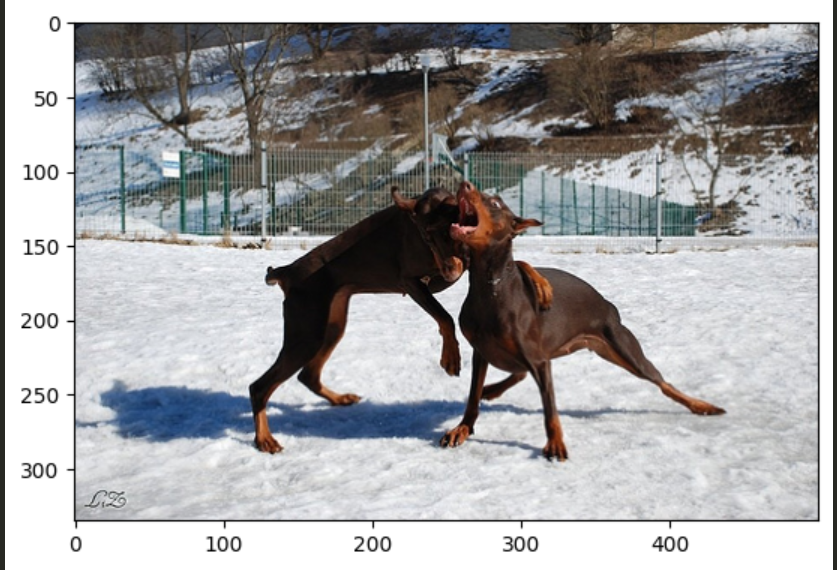

# Image Captioning Model using ResNet-18 and LSTM

This repository contains an image captioning model that uses ResNet-18 as a feature extractor and LSTM for generating captions. The model is fine-tuned on the Flickr8k dataset.

## Table of Contents

- [Introduction](#introduction)
- [Dataset](#dataset)
- [Model Architecture](#model-architecture)
- [Fine-Tuning](#fine-tuning)
- [Results](#results)

## Introduction

This project implements an image captioning system using a combination of a Convolutional Neural Network (CNN) and a Recurrent Neural Network (RNN). Specifically, ResNet-18 is used to extract image features, and an LSTM network is used to generate captions based on these features. The model is trained and fine-tuned on the Flickr8k dataset.

## Dataset

The [Flickr8k dataset](https://github.com/jbrownlee/Datasets/releases/tag/Flickr8k) consists of 8,000 images each paired with five different captions. It is commonly used for image captioning tasks.

## Model Architecture

- **Feature Extractor**: ResNet-18, a pre-trained CNN, is used to extract features from images. The final fully connected layer of ResNet-18 is removed to obtain image embeddings.
- **Caption Generator**: An LSTM network is used to generate captions from the image embeddings. The LSTM is trained to predict the next word in a sequence given the previous words and the image features.

## Fine-Tuning

Initially, the ResNet-18 model is used with pre-trained weights from ImageNet. To improve performance, we unfreeze some layers of ResNet-18 and fine-tune them on the Flickr8k dataset. Fine-tuning allows the model to learn specific features relevant to the dataset, potentially improving captioning accuracy.

## Requirements

- Python 3.6+
- PyTorch
- NumPy
- Pandas
- Matplotlib

## Results

After training, the model generates captions that describe the content of images. Below are some examples of generated captions:

### Example 1

*Generated Caption*: "a person be abseil down a cliff over water."

### Example 2

*Generated Caption*: "two dog play in the snow."
